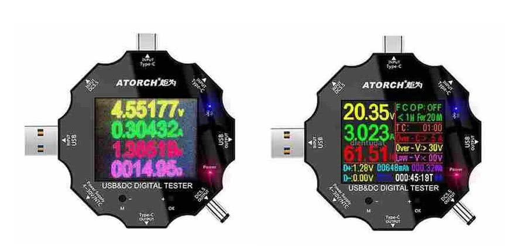
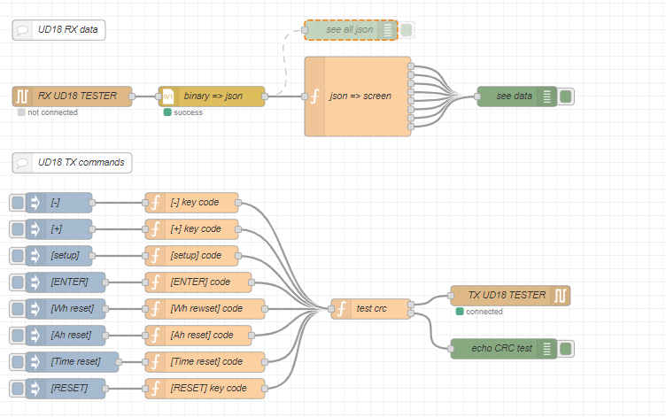

This low price device (13.88 €) is more than just a digital USB tester. See ATORCH UD18: 
- Aliexpress: [https://it.aliexpress.com/item/4000001021645.html](https://it.aliexpress.com/item/4000001021645.html)
- Banggood: [https://www.banggood.com/UD18-USB3_0DCType-C-18-in-1-USB-Tester-APP-DC-Digital-Voltmeter-Ammeter-HD-Color-Screen-6-Bit-High-Precision-Display-UD18-Bluetooth-Digital-Meter-p-1564949.html](https://www.banggood.com/UD18-USB3_0DCType-C-18-in-1-USB-Tester-APP-DC-Digital-Voltmeter-Ammeter-HD-Color-Screen-6-Bit-High-Precision-Display-UD18-Bluetooth-Digital-Meter-p-1564949.html) 

The measures that UD18 can carry out are:

- Tension: 3.6...32 V
- Current: 0...5.1 A
- Power: 0...163.99 W
- Equivalent resistance: 0...999.99 Ω

Furthermore:

- Time: 0...999 h
- Capacity: 0...99999 mAh (cumulative)
- Charge: 0...999.99 Wh (cumulative)
- USB-data+: 0...2,99 V
- USB-data-: 0...2.99 V

UD18 as also the optional capability to cut off the charge (FCOP) when some trigger conditions are meets.

UD18 can communicate via Bluetooth and two applications can be downloaded, one for WIN-PC and another App for smartphone (Android and iPhone). 

To use UD18 in **node-red** custom integrate projects we need:

- the *communication protocol* used by the device (see **UD18_protocool.txt**)
- **node-red** nodes to code+send commands and receive+decode data (see **UD18flow.json**).

For the full story see **UD18_01_en.pdf** (in italiano: **UD18_01_it.pdf**).
